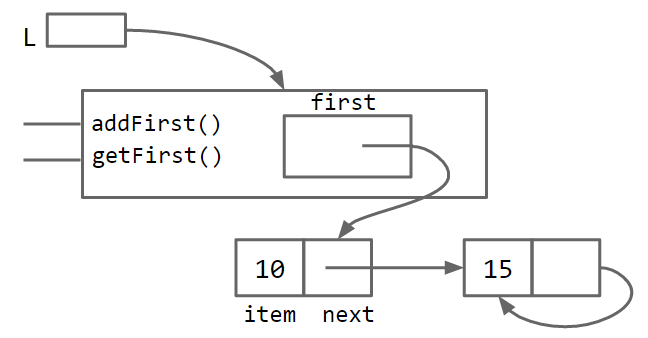
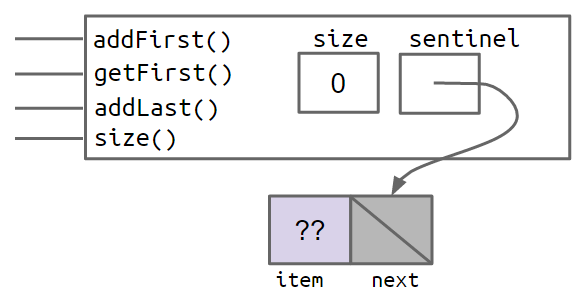
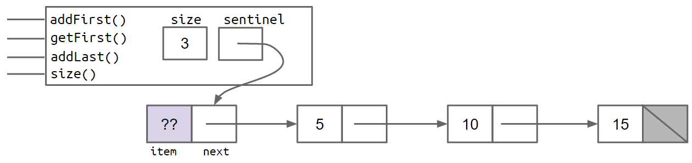

# SLLists

## Improvement #1: Rebranding

我们上次的`IntList`类如下，省略了辅助方法：

```Java
public class IntList {
    public int first;
    public IntList rest;

    public IntList(int f, IntList r) {
        first = f;
        rest = r;
    }
    //.....
}
```

我们的第一步是简单地重命名所有内容并丢弃帮助程序方法。这可能看起来不像进步，但相信我，我是一名专业人士。

```Java
public class IntNode {
    public int item;
    public IntNode next;

    public IntNode(int i, IntNode n) {
        item = i;
        next = n;
    }
}
```

## Improvement #2: Bureaucracy

知道`IntNodes`这很难使用，我们将创建一个名为`SLList`用户的单独类，用户将与之交互。基本类很简单：

```java
public class SLList {
    public IntNode first;

    public SLList(int x) {
        first = new IntNode(x, null);
    }
}
```

我们已经可以模糊地了解为什么`SLList`更好。将一个`IntList`的创建与一个`SLList`的创建进行比较。

```java
IntList L1 = new IntList(5, null);
SLList L2  = new SLList(5);
```

SLList隐藏了一个null对于用户.这个SLList类还不是非常有用.我们添加`addFirst`和`getFirst`方法作为简单的热身


### addFirst and getFirst

```Java
public class SLList {
    public IntNode first;

    public SLList(int x) {
        first = new IntNode(x, null);
    }
    
    public void addFirst(int x){
        first = new IntNode(x, first);
    }
    
    public int getFirst(){
        return first.item;
    }
}
```

`SSList`将更好被使用

```Java
SLList L = new SLList(15);
L.addFirst(10);
L.addFirst(5);
int x = L.getFirst();
```

比起等价的代码在`IntList`中

```Java
IntList L = new IntList(15, null);
L = new IntList(10, L);
L = new IntList(5, L);
int x = L.first;
```

## Improvement #3: Public vs. Private

不幸的是,我们的	`SLList`裸数据结构的原始力量（及其所有危险）可以被访问.一个程序员能够轻易的修改我们的列表不需要使用我们提供的方法.

例如:

```Java
SLList L = new SLList(15);
L.addFirst(10);
L.first.next.next = L.first.next;
```



这会导致具有无限循环的列表格式错误。为了解决这个问题，我们可以修改类，以便使用关键字private声明变量。

```Java
public class SLList{
    private IntNode first;
    ...
}
```

私有的变量个方法只能在一个.java文件中使用.例如,在这个案例中`SLList.java`.以为了如果有个像

下面的`SLLTroubleMaker`将无法通过编译,并且会发出`first has private access in SLList`的错误

```Java
public class SLLTroubleMaker{
    public static void main(String[] args){
        SLList L = new SLList(15);
        L.addFirst(10);
        L.first.next.next = L.first.next;
    }
}
```

相对的任何在`SLList.java`中的代码都能访问到`first`变量

当你创建一个`public`成员时必须小心,因为你必须有效的提供和支持这些成员的行为

### Improvement #4: Nested Classes

此时我们又两个java文件----`IntNode`和`SLList`.但是,这个`IntNode`只是一个起到一个辅助的角色

Java提供了我们在一个类内嵌套定义一个类的方法.

```Java
public class SLList{
    public class IntNode{
        public int item;
        public IntNode next;
        public IntNode(int i, IntNode n){
            item = i;
            next = n;
        }
    }
    
    private IntNode first;
    
    public SLList(int x){
        first = new IntNode(x, null);
    }
    .......
}
```

嵌套类对代码性能没有有意义的影响，只是保持代码井井有条的工具。

如果嵌套类不需要使用任何`SLList`的实例变量或者方法,你可以声明为`static`类.声明为`static`类意味着在这个静态类中的方法不能访问外面类的任何成员.在这个例子中,在`IntNode`中的任何方法都不能访问`first`,`add First`或者`getFirst`

这也许会节约空间.因为每个`IntNode`都不再需要保存如何访问其封闭类`SSList`

另一方面,如果你测试了上面的代码,你会看到`IntNode`类从来不会使用`SSList`中的`first`,或者其他的成员.因此,我们能过使用static关键字,这意味着该类不会获得对其老板的引用，从而为我们节省了少量内存。

### addLast（） 和 size（）

```Java
public class SLList {
    public class IntNode {
        public int item;
        public IntNode next;
        public IntNode(int i, IntNode n) {
            item = i;
            next = n;
        }
    }

    private IntNode first; 

    public SLList(int x) {
        first = new IntNode(x, null);
    }

    /** Adds an item to the front of the list. */
    public void addFirst(int x) {
        first = new IntNode(x, first);
    }    

    /** Retrieves the front item from the list. */
    public int getFirst() {
        return first.item;
    }

    /** Adds an item to the end of the list. */
    public void addLast(int x) {
        /* Your Code Here! */
        IntNode p = this;
        while(p.rest != null) p=rest;
        p.rest = new IntNode(x, null);
    }
	
    /** Returns the size of the list starting at IntNode p. */
    private static int size(IntNode p) {
        if (p.next == null) {
            return 1;
        }

        return 1 + size(p.next);
    }
    
    /** Returns the number of items in the list using recursion. */
    public int size() {
        /* Your Code Here! */
		return size(first);
    }

}
```

如果我们使用了上面的方式,我们可以看到两个方法都叫`size`,这在Java中时允许的,因为他们又不同的参数.这种有相同名字但是有不同的参数的方法叫**重载**

还有一种方法创建一个非静态的帮助器方法在`IntNode`类自身中.虽然方法很好,但是更倾向于没有任何方法在`IntNode`中.

# Improvement #5: Caching

考虑这个`size`方法.假定`size`函数在长度为1000的列表中花费2秒钟.我们可以想到在长度为1000000中,将花费2000秒,因为长度扩大了1000倍.

我们能重写`size`方法,使得无论列表多大,都只花费相同的时间.

为了实现这个,我们添加一个`size`变量到`SSList`中,跟踪当前的大小.这种保存重要数据以加快检索速度的做法有时称为**缓存**。

```Java
public class SLList{
    private IntNode first;
    private int size;
    
    public SLList(int x) {
        first = new IntNode(x, null);
        size = 1;
    }

    public void addFirst(int x) {
        first = new IntNode(x, first);
        size += 1;
    }

    public int size() {
        return size;
    }
    .....
}
```

上面的方法让我们`size`方法更快.当然这回减慢我们`addFirst`和`addlast`方法.也会增加我们类的空间但只是微不足道的。在这种情况下，权衡显然有利于创建大小缓存.

### Improvement #6: The Empty List

我们的`SSList`比起`IntList`有一些优势:

- `SLList`没看见`IntList`类
  - 更简单使用
  - `addFirst`更加高效
  - 避免了错误和`IntList`用户的错误或渎职行为。

- `size`方法比起`IntList`中的更快

另一个优势就是我们可以很轻松使用构造函数创建一个空表.最常使用的方法是把`first`设置成`null`如果表时空表的话

```Java
public SLList() {
    first = null;
    size = 0;
}
```

不幸的是,这会导致我们的`addLast`方法会冲突如果我们想在空表中添加`while (p.next != null)`使用`p.next`会导致空指针的错误.

```Java
public void addLast(int x) {
    size += 1;
    IntNode p = first;
    while (p.next != null) {
        p = p.next;
    }

    p.next = new IntNode(x, null);
}
```

### Improvement #6b: Sentinel Nodes

一个解决方法是把空表操作单独出来

```Java
public void addLast(int x) {
    size += 1;

    if (first == null) {
        first = new IntNode(x, null);
        return;
    }

    IntNode p = first;
    while (p.next != null) {
        p = p.next;
    }

    p.next = new IntNode(x, null);
}
```

这个解决办法可以,但是特定情境下的代码应该尽可能避免.因为我们想保持复杂度在可控范围之内.对于一个简单的类`SSList`而言,特殊的案例很少.但是像树这种结构将会变得复杂

另一个清晰简单的方法就是让操作对于所有的`SSList`都是相同的,哪怕是空表.我们可以创建一个特别的指针叫做`sentinel node`哨兵节点.这个哨兵节点有个我们并不关心的值.例如一个空表可以创建`SLList = new SLList()`如下节点



当我们添加了5,10,15之后看起来就像下面的



在上面的图中,这个??值代表了我们并不关心.由于有了哨兵,`SSList`将没有特殊情况,我们只是简单删除了特殊情况从`addLast`方法中

```Java
public void addLast(int x) {
    size += 1;
    IntNode p = sentinel;
    while (p.next != null) {
        p = p.next;
    }

    p.next = new IntNode(x, null);
}
```

可以看到这是很清晰的.

### 不变量

不变量是关于数据结构的事实，它保证为真（假设您的代码中没有错误）。

具有哨兵节点的 A`SLList`至少具有以下不变量：

- 引用始终指向哨兵节点`sentinel`。
- 前面的项目（如果存在）始终位于`sentinel.next.item` 。
- 该`size`变量始终是已添加的项目总数。

不变量使推理代码变得更加容易，并且还为您提供了确保代码正常工作的特定目标。